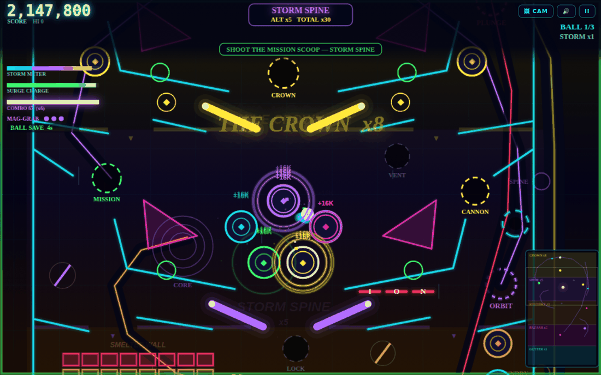
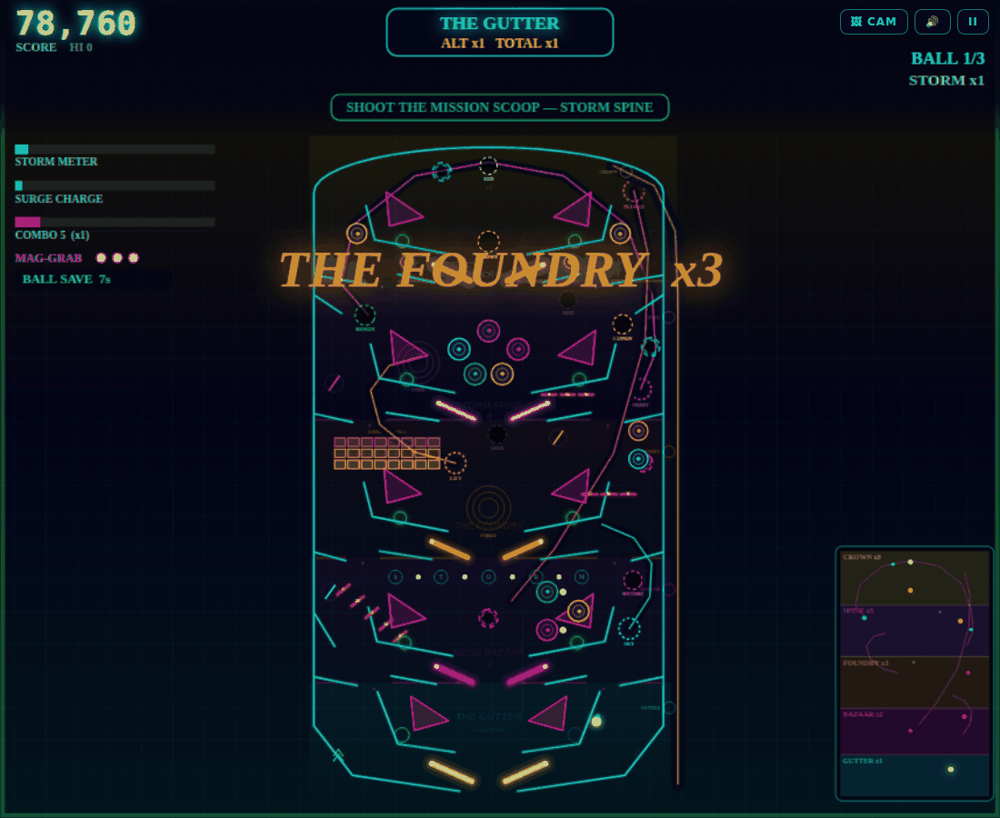
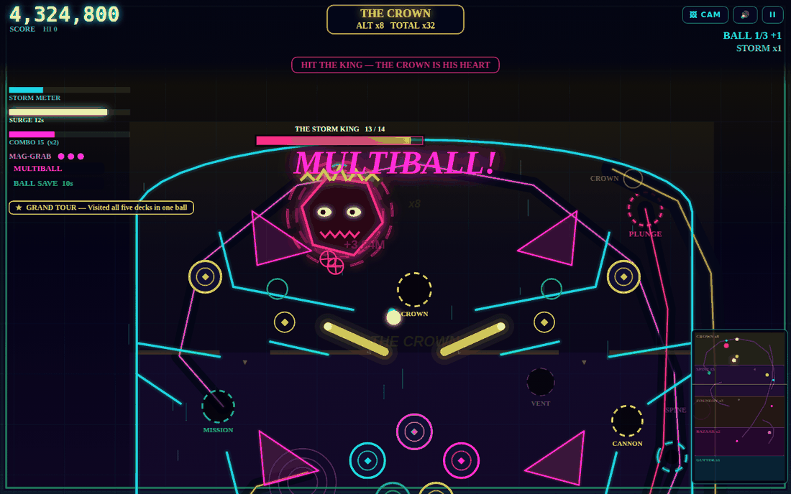

# Neon Storm: Ascension

A pinball machine ten times the size of your screen. Five decks stacked 2,900 pixels
high, each with its own flipper pair, and a camera that rides the ball.

**[Play it →](https://avinalabs.github.io/neonsa/)**

One HTML file. No dependencies, no assets, no build step to run it — every sound is
synthesised in the Web Audio API and every pixel is drawn to a canvas.



---

## The idea

The original table fitted on one screen. This one doesn't, so the rules had to change.

The playfield is **1,760 × 2,900** units — about ten times the area — laid out as a tower.
Each deck's floor has three openings: a left chute, a centre hole guarded by that deck's
own flippers, and a right chute. **Falling costs you a floor, not the ball.** Only the
Gutter at the bottom actually drains.

And **altitude is the multiplier**, which is what makes climbing worth the risk:

| Deck | Multiplier | What's up there |
|---|---|---|
| The Gutter | ×1 | Main flippers, outlanes, two kickbacks — the only place you can lose the ball |
| Neon Bazaar | ×2 | C‑H‑A‑O‑S drop bank, pop bumpers, mystery scoop, S‑T‑O‑R‑M lanes |
| The Foundry | ×3 | A breakout brick wall, the forge magnet, ball lock |
| Storm Spine | ×5 | Five‑bumper nest, mission scoop, reactor vent, an aiming cannon |
| The Crown | ×8 | The Storm King's arena, the crown shot, the lightning rod |



*Press `C` for the overview. Most of the time you'll never see the machine whole.*

---

## Controls

**Keyboard**

| | |
|---|---|
| `←` `→` or `A` `D` | Flippers — every deck's pair fires together, like the upper flippers on a real machine |
| `SPACE` (hold) | Plunger. The charge oscillates; release picks which floor you launch into |
| `SPACE` (in play) | MAG‑GRAB — three per ball. Fires the cannon when one is loaded |
| `Z` `X` `W` | Nudge left / right / up. Three nudges in quick succession and you TILT |
| `C` `P` `M` | Overview camera · pause · mute |

**Phone** — two large FLIP pads in the bottom corners (80×80 in portrait, held in from the
screen edge, because a thumb rests inboard of the corner) with NUDGE beside them, and LAUNCH
parked above-left of the right pad so the bottom centre of the screen — where the flippers
are — belongs entirely to the table. You can also just tap the left or right half of the
table, and **both thumbs work at once**: lifting one finger never drops a flipper another
is still holding. Landscape gets wide pill-shaped pads, which are a much bigger target for
the height they cost.

---

## What's in it

Four habitrails, two portal pairs, two magnets, a cannon you aim by timing · a
deck‑select plunger with a lit skill‑shot floor · seven timed missions — Meteor Shower,
Blackout, Gravity Flux, The Hunt, Overload, Echo Chamber, Rush Hour · clear four and the
**Storm King** wakes up in the Crown; beat him and Ascension six‑ball wizard mode opens ·
six power‑up orbs, a shard/surge economy, multiball, jackpots, kickbacks, ball save ·
weather that actually affects play (wind gusts lean the table, lightning strikes it) ·
achievements, arcade initials, a local top‑8 leaderboard, and a shareable score card.



---

## Running it

```bash
git clone https://github.com/avinalabs/neonsa.git
cd neonsa
open index.html          # or just double-click it
```

That's genuinely it — `index.html` is self-contained and works from `file://`.

To publish it: **Settings → Pages → Source: Deploy from a branch → `main` / `/ (root)`**.
It'll be live at `https://avinalabs.github.io/neonsa/`.

---

## Layout

```
index.html          the game — generated, do not edit by hand
index-classic.html  the original single-screen table, kept playable
build.mjs           joins src/ into index.html
src/                the actual source, split by concern
  01-shell.html       markup, CSS, all the screens
  02-core.js          constants, deck table, maths, the audio engine
  03-table.js         playfield geometry — every wall, toy and rail
  04-physics.js       camera and collision
  05-game.js          scoring, missions, boss, power-ups, ball lifecycle
  06-update.js        per-frame simulation
  07-render.js        world rendering
  08-hud.js           HUD, minimap, score card
  09-input.js         game flow, input, the frame loop
test/               Playwright smoke, soak and performance suites
docs/               screenshots
```

`index.html` is the concatenation of `src/` in filename order — nothing clever, no
bundler. Four thousand lines in one document is miserable to edit, so the source is split;
the shipped artefact stays a single file you can email to someone.

```bash
npm run build          # regenerate index.html from src/
node build.mjs --check # fail if index.html is stale (CI runs this)
```

---

## Tests

```bash
npm install
npx playwright install chromium
npm test               # smoke: 7 viewports, pads vs ball, zoom recovery, game-over, multi-touch
npm run test:soak      # 6 x 300 simulated seconds, hunting for stuck balls
npm run test:perf      # frame-time budget
```

The page exposes `window.__NSA__` as a test harness — `start()`, `launch(power)`,
`step(frames)`, `info()`, `flip(side, on)`, `forceMission(id)`, `forceBoss()`,
`drain()`, `flipState()`. `step()` drives the simulation directly instead of waiting on
real frames, so the soak test plays 300 seconds of pinball in about four.

**The soak test looks for motion, not score.** A ball that stays inside a 60px box for
seven seconds is wedged in the geometry; a ball that scores nothing is just cradled on a
flipper, which is fine. That distinction is what makes the test useful.

---

## If you edit the table

Every one of these caused a real ball trap, and they are all easy to reintroduce:

- **Lane corridors need ≥ 60px of clearance.** The ball is 40 across.
- **Never end an inlane floor on a flipper pivot.** A ball sitting on the pivot gets no
  tangential velocity when the flipper swings — it's a dead spot. Feeds must release the
  ball *over* the blade.
- **No surface may run underneath a flipper blade.** The deck floors stop at the pivots;
  anything continuing past them makes a pinch the ball jitters in forever.
- **Guide walls must slope away from the side wall**, or they form a V-trap in the corner.
- **Aprons need ~8° of slope.** At 4° a ball creeps instead of sliding to the drain.
- **Canvas interpolates gradient stops un-premultiplied** — a bright low-alpha stop beside
  a dark high-alpha one renders as a bright band, not a subtle tint.

**A landscape phone is a 4:1 letterbox, and `cam.tview` is a world *height*.** A value that
looks sane as a height — `VIEW_MIN`, say — spreads across four times the table's width
there, so the machine used to sit in the middle of the screen as a thin ribbon with a
ten-pixel ball and black either side. Short windows therefore frame by **width**: fit the
1,760-unit table across the screen and take whatever vertical slice falls out. Nothing is
gained by looking past the side walls. On an iPhone 16 Pro Max in Safari landscape that
took the table from 52% of the screen width to 88%, and the ball from 11px to 19px.
`test/smoke.mjs` asserts the table fills at least 72% of the width on every touch viewport.

In landscape, Safari's own address and tab bars take about a quarter of the height. The
game carries the iOS web-app meta tags, and the start screen tells iOS players in a browser
tab that **Share → Add to Home Screen** gets that quarter back — the one thing no amount of
layout work can do for them.

On phones the table is deliberately drawn **lower than the camera will ever frame the
ball**. `hudBottomH()` is the framing band — the camera never lets the ball or the flippers
fall below it — while `clipBotH()` is the drawing band, which runs almost to the bottom
edge. The machine therefore continues underneath the floating pads, so you see more of it,
while the shot you are actually taking stays above them. On a short screen the same applies
at the top: the table runs up behind the instrument bar, which only tints it. `test/smoke.mjs` plays 60
simulated seconds on each touch viewport and fails if the ball's on-screen circle ever
intersects a pad.

And on rendering: neon is drawn as **layered strokes**, wide-and-faint under
narrow-and-bright, over `Path2D` geometry baked once at load. It used to use canvas
`shadowBlur`, which cost 120 blur passes a frame and roughly doubled frame time.
`test/perf.mjs` guards against that coming back.

---

## iOS will pinch-zoom the page out from under you
Two thumbs on the flipper pads that drift slightly read as a pinch, and `user-scalable=no`
has been ignored since iOS 10. The page carries the usual prevention — `touch-action:none`,
`gesturestart`/`change`/`end` cancelled, multi-touch `touchstart` **and** `touchmove`
cancelled, a double-tap guard — and it still got beaten in the field: a report came back
with the page sitting at **1.62×**, panned to the bottom-right, score and half the table
off-screen.

Nothing the canvas draws can help there, because the whole document is magnified — the DOM
buttons measured 1.62× too, which is how you tell this apart from a camera bug from one
screenshot. So it is treated as a state to detect and escape, not one to hope never happens:

- `visualViewport.scale > 1.03` **pauses the simulation immediately** — a ball draining
  where you cannot see it is the part that actually costs you a game — without opening the
  pause card, which is laid out in page coordinates and would be off-screen too.
- A banner is positioned onto `visualViewport`'s visible rect and counter-scaled by
  `1/scale`, so it reads at a normal size however far the zoom went.
- Its button re-asserts `maximum-scale=1` on the viewport meta and restores it a moment
  later. That is the one thing that reliably snaps iOS Safari back to 1, and it only works
  from a user gesture — hence a button rather than a silent fix.
- When the scale returns to 1 the banner clears and play resumes on its own.

`test/smoke.mjs` fakes a pinch by overriding `visualViewport` and checks all of it.

---

## License

No license — all rights reserved. The source is public to read, but nobody has permission
to reuse it. Add a `LICENSE` file whenever you want that to change.
